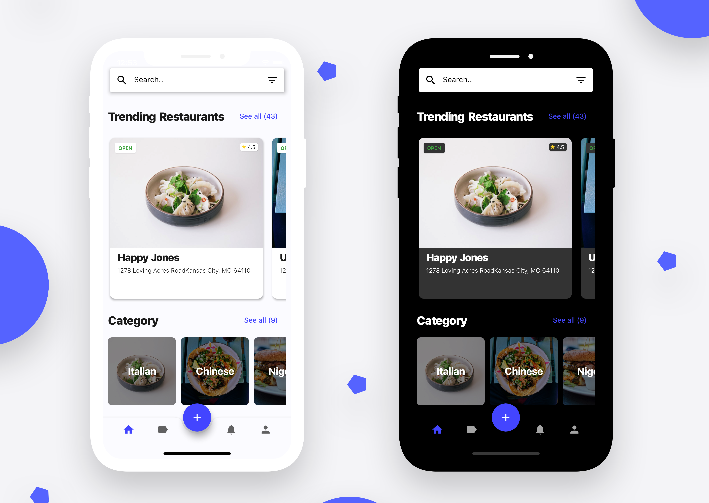

# 🍔RestoUI

Flutter representation of a Restaurant app UI

## 📸 ScreenShots

| 1 | 2|
|------|-------|
|||

| 3 | 4|
|------|-------|
|||

## ✨ Requirements
* Any Operating System (ie. MacOS X, Linux, Windows)
* Any IDE with Flutter SDK installed (ie. IntelliJ, Android Studio, VSCode etc)
* A little knowledge of Dart and Flutter
* A brain to think 🤓🤓
